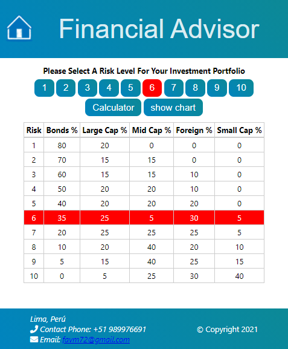
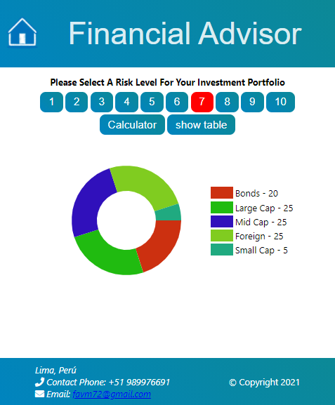
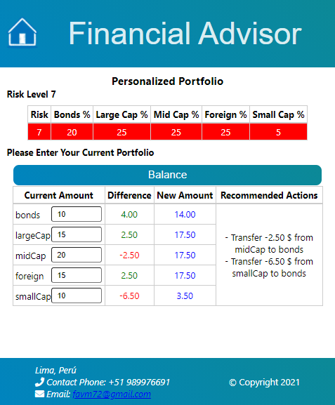

# Finantial Advisor

This project was made as a challenge by using react.

## Instructions

In order to run the project locally, just download the sources or clone the project using the command line.

`git clone https://github.com/favm72/react-finantial-advisor.git`

then, locate the terminal at the root project folder and run the following command:

`npm start`

Open [http://localhost:3000](http://localhost:3000) to view it in the browser.

The page will reload if you make edits.

If you decide to deploy it to a server, just run the command:

 `npm run build`

It correctly bundles React in production mode and optimizes the build for the best performance.

then you can upload the files to a server manually, or in the caso of sites that allows GitHub connectivity you can make automatic deployments (ex. Aws, Heroku)

## About the site

It allows a person to evaluate risk levels for investment portfolio.

### Home Page

The home page shows percentages distributed on 5 categories for each risk level from 1 to 10.

The user can select a risk level and see a doughnut chart.

### Calculator Page

This page allows the user to input custom investment quantities for every category, and make a balance for the selected risk level choosen before.

It also shows a list of recommended Transfer actions.

### Demo

This site is currently deployed with Heroku:

[https://finantial.herokuapp.com/](https://finantial.herokuapp.com/)

